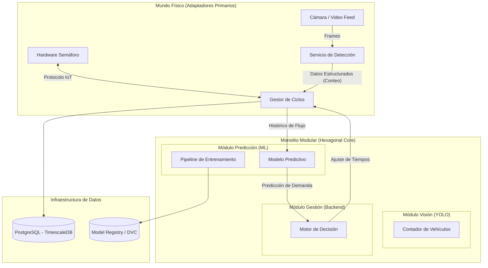

# Arquitectura del Sistema: Plataforma de Gestión de Tránsito Inteligente

## 1. Estrategia Arquitectónica: Monolito Modular
[cite_start]El sistema sigue un patrón de **Monolito Modular**[cite: 88]. [cite_start]Esto permite mantener todo el código en una única unidad de despliegue para simplificar la tesis inicial, pero con límites estrictos entre módulos (Visión, Predicción, Gestión) para permitir una futura refactorización a **Microservicios** sin reescribir la lógica de negocio[cite: 89, 90].

### Principios Fundamentales
* [cite_start]**Arquitectura Hexagonal (Puertos y Adaptadores):** Desacoplamiento total entre la lógica de tráfico (Core) y las tecnologías externas (Cámaras, Base de Datos, Semáforos)[cite: 62].
* [cite_start]**Código Limpio:** Separación estricta entre código de producción ([src/](file:///Users/rasec/Documents/github/Proyecto%20de%20Tesis/CerebroVial/src)) y experimentación ([notebooks/](file:///Users/rasec/Documents/github/Proyecto%20de%20Tesis/CerebroVial/notebooks))[cite: 29].
* **MLOps First:** El modelo no es un archivo estático; es parte de un pipeline reproducible.

## 2. Diseño del Sistema (Mermaid Flow)
[cite_start]El siguiente diagrama define el flujo de datos y la interacción entre módulos[cite: 409]:

